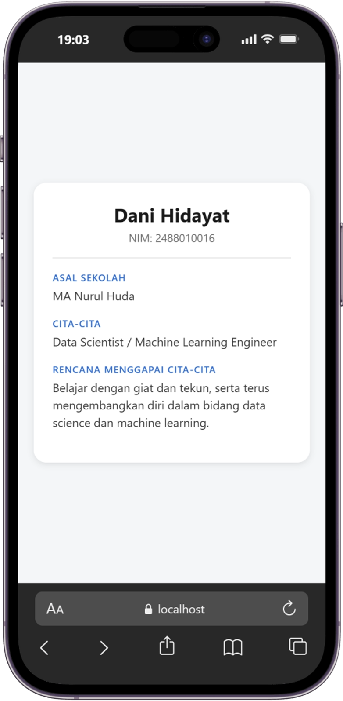

# Praktikum Menyiapkan Lingkungan Pengembangan dan Memualai Pemrograman Mobile (React Native) #
## Tujuan Pmebelajaran ##
Mahasiswa mampu :
1. Menyiapkan lingkungan pengembangan dan memulai pemrograman mobile (react native)
2. Membuat aplikasi mobile sederhana dengan react native
3. menyelesaikan tugas cv sederhana dengan react native 

## Materi dan Lingkungan Praktikum ##
1. Menyiapkan lingkungan pengembangan dan memulai pemrograman mobile dengan React Native
- memastikan instalasi git bash
- cek instalasi git bash (git --version)
- bukti verifikasi

- memastikan adanya node 

2. membuat aplikasi / projek baru dengan react native framework Expo Go
- buka dan baca dokumentasi resmi https://reactnative.dev/docs/
- buka dan baca dokumentasi resmi https://expo.dev/
getting-started 
- memulai project baru
- open terminal change directory ke pertemuan-2
- masukkan perintah (npx-create-expo-app ptmn2 --template blank)
- bukti verifikasi

- Running Projek 
   - Cd ke ptmn2
   - npx expo start
   - Install Expo Go di Android atau IOS
   - bisa juga menggunakan Web emulator di Laptop / PC
   - Setelah berhentikan (ctrl + C)
   - Install (npx expo install react-dom react-native-web)
   - npx expo start --web
   - Konfirmasi Keberhasilan

   

4. Tugas Praktikum
    - Membuat aplikasi CV sederhana dengan React Native
    - Nama Lengkap
    - NIM
    - Asal Sekolah
    - Cita-cita
    - Rencana Menggapai cita-cita
    - konfirmasi keberhasilan

