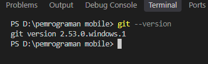
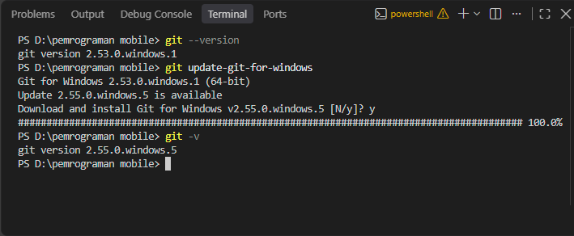
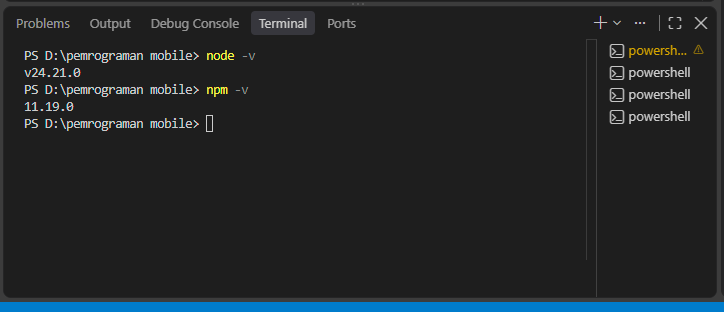
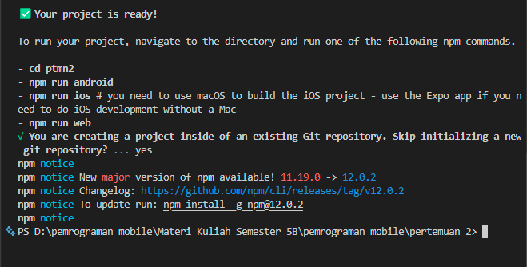

# Praktikum Menyiapkan Lingkungan Pengembangan dan Memualai Pemrograman Mobile (React Native) #
## Tujuan Pmebelajaran ##
Mahasiswa mampu :
1. Menyiapkan lingkungan pengembangan dan memulai pemrograman mobile (react native)
2. Membuat aplikasi mobile sederhana dengan react native
3. menyelesaikan tugas cv sederhana dengan react native 

## Materi dan Lingkungan Praktikum ##
1. Menyiapkan lingkungan pengembangan dan memulai pemrograman mobile dengan React Native
- memastikan instalasi git bash
- cek instalasi git bash (git --version)
- bukti verifikasi

- memastikan adanya node 

2. membuat aplikasi / projek baru dengan react native framework Expo Go
- buka dan baca dokumentasi resmi https://reactnative.dev/docs/
- buka dan baca dokumentasi resmi https://expo.dev/
getting-started 
- memulai project baru
- open terminal change directory ke pertemuan-2
- masukkan perintah (npx-create-expo-app ptmn2 --template blank)
- bukti verifikasi

- running project
    - cd ke ptmn2
    - npx xpo start
    - install xpo go di android/ios
    - setelah berhentikan (ctrl + c)
    - install 