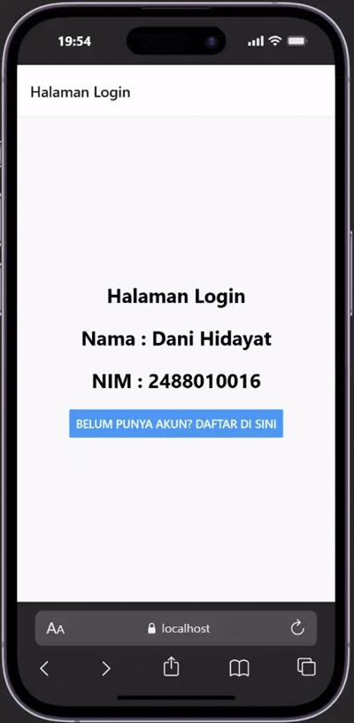
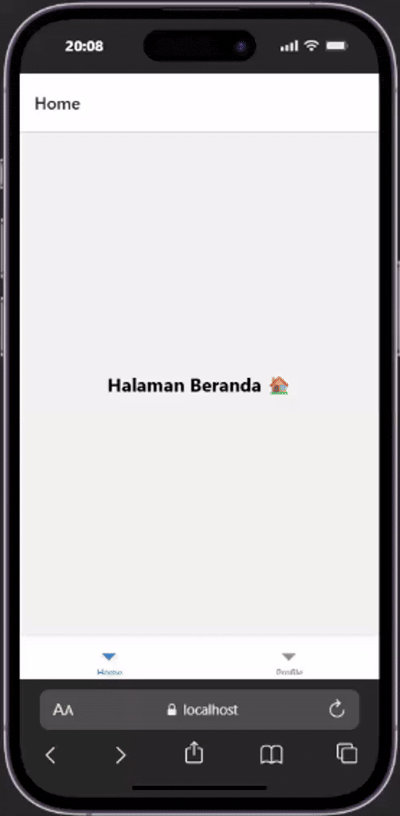

# Praktikum 4: React Native navigation #

## Tujuan Pembelajaran #
Mahasiswa mampu:
1. Merancang dan menerapkan navigasi antar layar (screen) pada aplikasi React Native
2. Menggunakan Library React Navigation (Stack navigator, Tab navigator, Drawer Navigator).

## Alur Praktikum ##

### Langkah 1: Inisialisasi Proyek React Native ###
1. Buka Terminal atau cmd
2. Ubah direktori ke folder pertemuan 4
3. Buat proyek baru menggunakan perintah : 'npx create-expo-app ptmn4 --template blank'
4. Ubah direktori ke folder ptmn4
5. Install core navigation library
npm install @react-navigation/native
6. Install dependensi pendukung (wajib untuk Expo)
npx expo install react-native-screens react-native-safe-area-context react-native-gesture-handler react-native-reanimated

### Langkah 2: Membuat Stack Navigator ###
1. Instalasi Pustaka Stack 'npm install @react-navigation/native-stack'
2. Buat folder didalam projek dengan nama screens
3. didalam folder screens buat 2 file login.js dan signup.js
4. masukkan kode sesuai pada modul
5. sesuaikan file app.js dengan kode pada modul
6. simpan dan install depedncy expo web
7. Jalankan expo web
8. Konfirmasi bukti

### Langkah 3: Membuat Bottom Navigator
1. Instalasi Pustaka Bottom Tabs npm install @react-navigation/bottom-tabs
2. Membuat Layar Baru : Buat file `HomeScreen.js` dan `ProfileScreen.js` di dalam folder `screens`.
3. Konfigurasi Tab di `App.js`
4. Konfirmasi Bukti

### Langkah 4: Membuat Drawer Navigator
1. Instalasi Pustaka Drawer npm install @react-navigation/drawer
2. Konfigurasi Drawer di `App.js`: Ubah kembali file `App.js` untuk mencoba Drawer Navigation menggunakan layar Home dan Profile yang sudah dibuat sebelumnya:
3. **Catatan Penting:** Geser layar dari kiri ke kanan pada emulator Anda untuk memunculkan menu Drawer.
4. Konfirmasi Bukti

